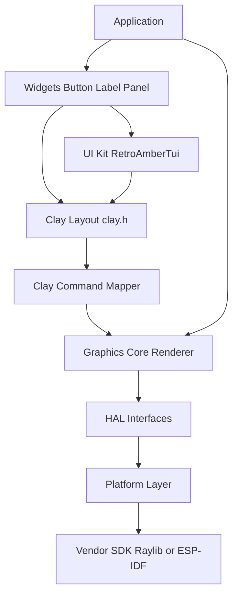

# Zyngine Stage 1: Platform-Agnostic Framework + ESP-IDF

## Locked decisions

| Decision | Choice |
|----------|--------|
| ESP path | **Pure ESP-IDF** (no Arduino framework, no `Arduino.h`) |
| Future Arduino | Separate `platform/arduino/` backend later — **not** PlatformIO |
| Desktop | Keep **Raylib** as present/window backend |
| Language | **C++17** |
| Apps | Engine-first (**3C**); Tetris/demos may break / stay out of default build |
| UI kit | Scaffold + **Button / Label / Panel** + retro **green/amber TUI** theme |
| Layout | Vendor **[Clay](https://github.com/nicbarker/clay)** (`clay.h`) |
| Clay rendering | **One shared** Clay→Graphics Core translator (all platforms). Do **not** wire Clay’s official Raylib renderer into the engine. Desktop Graphics Core still flushes via Raylib. |
| Display on ESP | Keep **LovyanGFX in ESP-IDF mode** behind `hal::Display` (reuses ILI9486 parallel config; no Arduino). Replace later with thinner `esp_lcd` if desired. |

## Target architecture



**Layer rules**

- Apps use Zyngine APIs only (engine, graphics, widgets, board config headers).
- Platform headers (`esp_*`, Raylib, future Arduino) live only under `src/platform/<name>/`.
- No `#ifdef ESP32` in core/graphics/ui — platform selection is CMake + one compile definition (e.g. `ZYN_PLATFORM_DESKTOP` / `ZYN_PLATFORM_ESPIDF`).

## Target tree (incremental move)

```
zyngine/
  CMakeLists.txt
  cmake/ZynginePlatform.cmake
  third_party/clay/clay.h          # vendored, pinned commit
  include/zyngine/
    core/          # engine loop, types, result codes
    graphics/      # renderer, surface, color, texture, math
    ui/
      clay/        # Clay init/arena helpers + command mapper API
      widgets/     # Button, Label, Panel
      themes/      # StyleTokens + RetroAmberTui
    hal/           # Display, Gpio, Spi, I2c, Time, Log, Fs, Mutex
    board/         # pin/board structs (data only; no parser yet)
  src/
    core/
    graphics/      # move ZynRenderer math/raster; strip platform ifdefs
    ui/widgets/ ui/themes/ ui/clay/
    hal/           # thin free functions / small classes (headers in include)
    platform/
      desktop/     # Raylib present, host time/fs/log, simulated input stubs
      espidf/      # ESP-IDF GPIO/SPI/time/log/fs + LovyanGFX display
      arduino/     # stub README + empty CMake option for later
  boards/
    desktop/board.hpp
    esp32_s3_zune/board.hpp   # pins moved from config_user.h
  examples/                    # park old mains; not required to build in Stage 1
  tests/
```

## Build system

**Root CMake (desktop library + optional example)**

- `add_library(zyngine ...)` with `PUBLIC` includes under `include/`.
- `ZYN_PLATFORM=desktop|espidf` (cache string).
- Desktop: find Raylib, link `platform/desktop`, define `ZYN_PLATFORM_DESKTOP`.
- Modular targets preferred: `zyngine_core`, `zyngine_graphics`, `zyngine_ui`, `zyngine_hal_iface`, `zyngine_platform_<name>` — or one `zyngine` lib composed from object libs if simpler initially.
- C++17: `target_compile_features(... PUBLIC cxx_std_17)`.
- Remove [`platformio.ini`](platformio.ini), PlatformIO `.vscode` recommendations tied to PIO, and Arduino-centric assumptions from docs.

**ESP-IDF component**

- Add `src/platform/espidf/` as an IDF component (or `components/zyngine` that points at the library sources) so `idf.py build/flash/monitor` works.
- App entry: `app_main()` in a minimal smoke component (not Tetris).
- Dependencies: ESP-IDF drivers + LovyanGFX as IDF-compatible dependency (git component or FetchContent), **not** Arduino.

**Platform selection:** CMake chooses which `platform/*` sources are compiled. Core never includes both.

## Phase 1 — CMake desktop, kill PlatformIO

1. Introduce root [`CMakeLists.txt`](CMakeLists.txt) + `cmake/ZynginePlatform.cmake`.
2. Relocate engine sources from flat [`lib/zyngine/`](lib/zyngine/) into `include/zyngine/` + `src/` ( mechanize with moves; preserve APIs where practical: `Zyngine`, `ZynRenderer`, math/color/texture).
3. Split Raylib present path into `platform/desktop/` implementing HAL (`Display::flush`, `Time::millis`, `Log`, host `Fs` via `fopen`).
4. Replace manual `config_user.h` dual-macro switch with CMake `ZYN_PLATFORM`.
5. Board pins → [`boards/esp32_s3_zune/board.hpp`](boards/esp32_s3_zune/board.hpp) / desktop stub (structs + constexpr pins; no parser).
6. Delete PlatformIO entrypoints; update README for `cmake -B build -DZYN_PLATFORM=desktop && cmake --build build`.
7. Park [`src/main.cpp`](src/main.cpp) (+ demo variants) under `examples/` **excluded from default build** (per 3C).

**Exit criteria:** Desktop library compiles; PlatformIO gone; Raylib window path still works via a tiny smoke `examples/desktop_smoke` (optional but recommended so “desktop continues to work” is verifiable without Tetris).

## Phase 2 — HAL + Graphics Core cleanup

**HAL interfaces** (platform-free headers under `include/zyngine/hal/`):

- `Gpio`, `SpiBus`, `I2cBus`, `Time`, `Log`, `Mutex`, `Filesystem`, `Display` (init, resolution, present/flush, optional backlight).

Implement:

- `platform/desktop/*` — enough for simulation (Display = Raylib render texture + blit; Gpio/input stubs OK).
- Move SD/`fopen` branching behind `Filesystem`.
- Strip `#ifdef ZYNGINE_*` from graphics/core; inject `Display&` / surface into renderer.

**Graphics Core** (theme-agnostic): keep software rasterizer + 2D primitives from [`zynrenderer`](lib/zyngine/zynrenderer.h); ESP dirty-rect (`diffDraw`) becomes `Display`/`Surface` present strategy, not `#ifdef` in draw calls.

## Phase 3 — Pure ESP-IDF backend

1. `platform/espidf/`: GPIO, time (`esp_timer`), delay, log (`ESP_LOG*`), SPI+FATFS for SD, mutex (FreeRTOS).
2. `Display`: port [`ParallelILI9486`](lib/zyngine/zyndrivers.cpp) to LovyanGFX **ESP-IDF** build; pins from board header.
3. Replace Arduino-only pieces with IDF equivalents or stubs for Stage 1:
   - Touch / encoder / PS2: **stub or minimal** (not required for library smoke).
4. IDF project layout: `boards/esp32_s3_zune` + example `examples/espidf_smoke` with `app_main` that clears screen / draws a rect via Graphics Core.
5. Verify `idf.py build` (flash/monitor when hardware available).

**Exit criteria:** Zyngine links as ESP-IDF component; smoke example builds with `idf.py`.

## Phase 4 — Clay + UI kit (retro amber/green TUI)

### Clay integration

- Vendor `third_party/clay/clay.h` (pinned commit/tag); one TU defines `CLAY_IMPLEMENTATION`.
- `zyngine::ui::ClayHost`: arena from static/PSRAM buffer, `Clay_Initialize`, measure-text callback via Graphics Core font metrics.
- **Embedded memory:** default low `Clay_SetMaxElementCount` (hundreds, not 8192). Document PSRAM arena on ESP32-S3.
- `zyngine::ui::renderClayCommands(Clay_RenderCommandArray, GraphicsCore&)` — shared mapper for `RECTANGLE`, `TEXT`, `BORDER`, `SCISSOR_*`, `IMAGE`, `CUSTOM`. Used by desktop and ESP-IDF identically.

### Widgets (behavior only)

- `Label`, `Button` (pressed/hovered/disabled), `Panel` — build Clay declarations each frame; no draw code inside widgets.
- Pointer/touch fed through `Clay_SetPointerState` from HAL input when available; desktop mouse via Raylib.

### Theme: Retro Amber / Green TUI

- `StyleTokens`: bg, fg, accent, dim, border, font sizes, padding, focus ring.
- `RetroAmberTui` (default) + optional green phosphor variant via token preset (same draw helpers).
- Look: dark bg, amber or green monospace text, box-drawing-style borders, high-contrast panels — CRT/terminal feel, not Material.
- Theme supplies colors/spacing into Clay element configs + any `CUSTOM` widget chrome helpers.

### Preserve existing 3D path

- Game/3D demos keep calling Graphics Core directly; Clay is the UI layout path, not a replacement for the rasterizer.

## Phase 5 — Cleanup + docs

- Remove dead Arduino includes, unused PIO lib deps surface, stale `config_user.h`.
- Stub [`src/platform/arduino/README.md`](src/platform/arduino/README.md): how a future Arduino HAL backend plugs into the same interfaces.
- README: desktop CMake, ESP-IDF `idf.py`, architecture diagram, Clay memory notes, “apps are examples / may lag”.
- Namespace gradually toward `zyngine::` while keeping thin `Zyn*` aliases if needed to reduce churn.

## What we explicitly will not do in Stage 1

- Full Tetris/widget migration.
- STM32 / Pico backends (directory hooks only if trivial).
- Board-description file parser.
- Arduino platform implementation (scaffold/docs only).
- Reintroducing PlatformIO.
- Dual Clay renderers (no official Clay-Raylib path in-tree).

## Risk notes

- **Clay arena size** on ESP without careful max-element tuning can exhaust RAM — tune defaults early.
- **LovyanGFX IDF packaging** needs care (component vs FetchContent); fallback is a minimal parallel ILI9486 driver if LovyanGFX IDF integration fights CMake.
- **Pin conflicts** (parallel bus vs touch) stay documented in board header comments from current [`zyndrivers.cpp`](lib/zyngine/zyndrivers.cpp) / [`config_user.h`](lib/zyngine/config_user.h).
- Incremental commits: Phase 1 compile → Phase 2 compile → Phase 3 IDF compile → Phase 4 UI compile.
